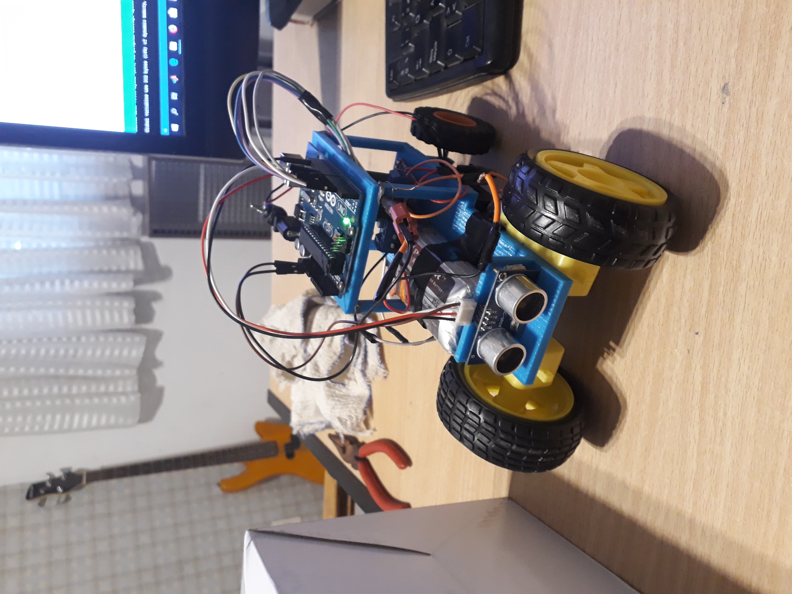

# Control of car position

In this projet we implemented a position control of a litle car we also mecanicaly designed from scratch

The car has 2 CC motors driven by an H bridge Controled by an Arduino ONE, 
the arduino get position values from an ultrasound sensor and 
the arduino code implements a PID controller to define an output value U for controlling the cars position. The hole system is powered by a 11V LIPO battery

You can see the finished car working in the 'movie' video in Franco folder 

The arduino code and the mecanical design files are in the Franco folder

